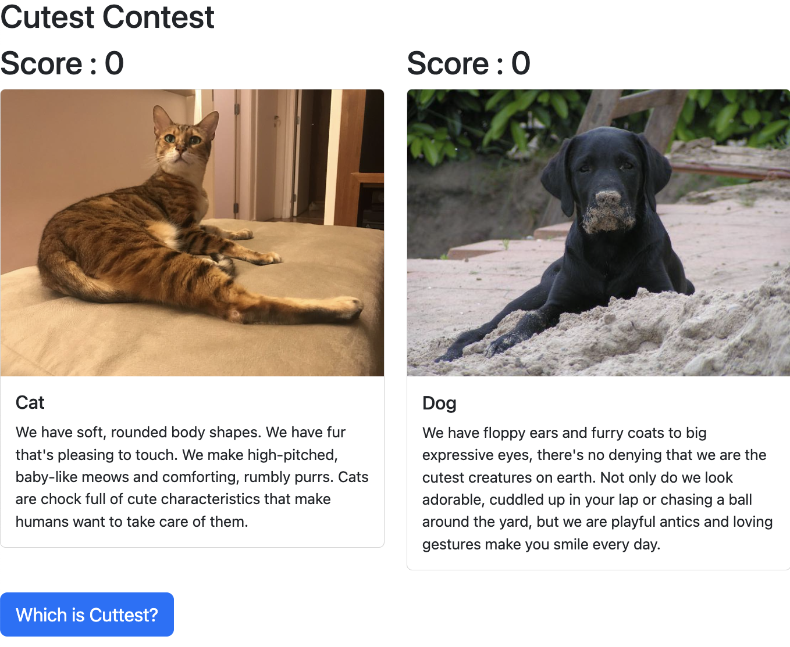

<h2 align="center">
  308A.4 - AJAX and Data Fetching
  <a href="https://hannah-moon.github.io/21_JS_CatnDog_AJAX-and-Data-Fetching/" target="_blank">Cutest Contest</a>
</h2>

  

 

## Built With

**Language:** JS, HTML, CSS, Bootstraps

---
## Learning Objectives

- Describe the purpose of AJAX and the XMLHttpRequest object.
- Use AJAX to make requests from a server without reloading the webpage.
- Use AJAX to receive and work with data from a server.
- Use the fetch API to asynchronously communicate with a server.
- Use the axios library to asynchronously communicate with a server.

